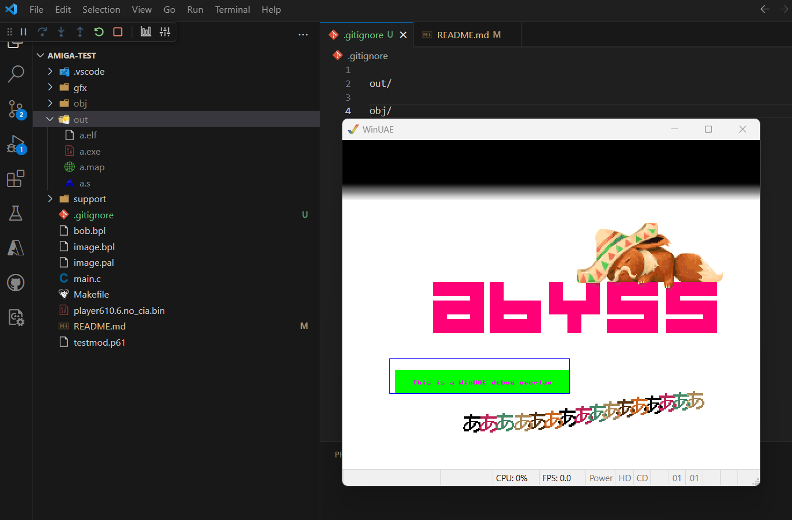

# amiga-test

A minimal project for testing Amiga c/c++ extension and command "Amiga: Init Project" in visual studio code

May be debugged (F5) using the winuea emulator and vscode editor

Use cmd as terminal as git bash does not work

You might have to add out/ and obj/ folders manually
